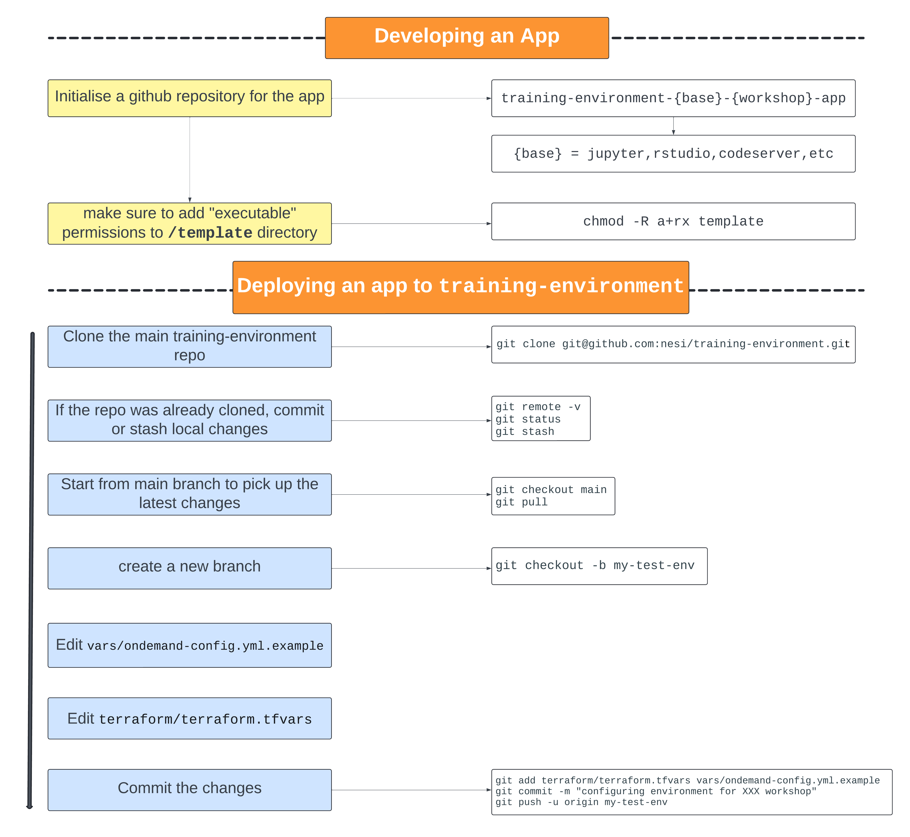

# Overview

REANNZ ephemeral training environments, running on Flexi HPC, deployed using Terraform and Ansible and using [Open OnDemand](https://osc.github.io/ood-documentation/latest/index.html) as the user interface.

## Architecture

The training environment consists of multiple VMs:

- web node VM
    * running the Open OnDemand web node software
    * LDAP client
- services node VM
    * LDAP server
    * Keycloak
    * NFS server sharing training user home directories
- kubernetes cluster
    * the users' Open OnDemand apps run here (JupyterLab, RStudio, etc.)
    * each node in the cluster is an LDAP client

## Apps

Open OnDemand [interactive applications](https://osc.github.io/ood-documentation/latest/index.html), such as JupyterLab and RStudio, are used for the training courses.
Open OnDemand app development is described in detail in their [documentation](https://osc.github.io/ood-documentation/latest/how-tos/app-development.html).

In particular, the training environment uses a kubernetes cluster for running the apps, so the apps are developed similarly to the kubernetes examples on the Open OnDemand website:

- [Add a Jupyter App on a Kubernetes Cluster](https://osc.github.io/ood-documentation/latest/tutorials/tutorials-interactive-apps/k8s-jupyter.html)
- [Add a Jupyter App on a Kubernetes Cluster that behaves like HPC compute](https://osc.github.io/ood-documentation/latest/tutorials/tutorials-interactive-apps/k8s-like-hpc-jupyter.html)

Key points about apps on our training environment:

- Apps are created as docker images
- Apps are set up as LDAP clients so *training* and *trainer* users are identified correctly within the container
    * the nslcd socket from the kubernetes worker node is bound into the container at the correct location
    * the */etc/nsswitch.conf* file from the kubernetes worked node is bound into the container
    * LDAP client packages are installed inside the container (nslcd, etc)
- All home directories are bound into the container (so *trainer* users can access *training* users' homes from within the apps if needed)

More details about apps can be found in the tutorials.

## User accounts

Within the training environment we create two different types of user accounts, *training* users and *trainer* users, with randomly generated passwords.

- *training* accounts
    * isolated accounts that can only access their own home directory
- *trainer* accounts
    * have read-only access to *training* user home directories, to monitor progress and assist
    * can use the browser based terminal from the OnDemand web interface
    * can view running pods on the kubernetes cluster

## Overall workflow

