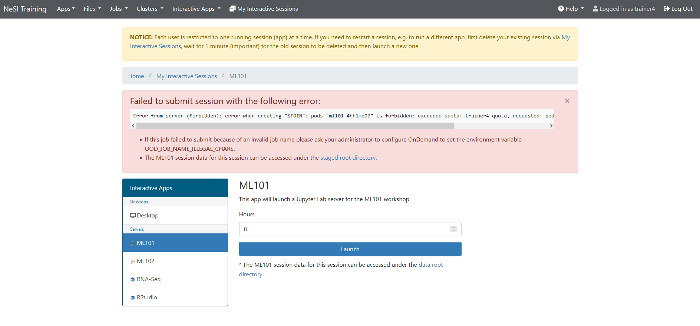

# Known issues and limitations

Some known issues and current limitations of the training environment are listed on this page.

## Failed to submit session error

Seeing an error similar to the above image is usually caused by trying to start a new session when one is already running (all users are limited to one running session to ensure there are enough resources for everyone).

Follow the steps [here](notes-for-trainers.md#session-limits) to stop your existing session before starting the new one.

## Timeouts on login page

If you leave the login page open for a while without logging in you may encounter a timeout error when you do eventually login.
Opening a new tab and navigating to the webnode URL should fix this. It would be a good idea to login immediately after opening the training environment URL until we have fixed this timeout issue.

## Sharing the link to the training environment

Make sure you **only share the webnode URL**, which will look like "https://*name*-ood-**webnode**.data.nesi.org.nz".

Do not share the services URL (which is the URL you see on the login screen) that looks like "https://*name*-ood-services.data.nesi.org.nz". If you share this link it will almost certainly not work for others.
