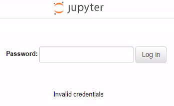

# Notes for trainers

## Viewing training user's files

All *trainer* users should have read and write access on all *training* users home directories to help with debugging issues, checking progress, etc. The paths to the home directories will look like:

```
/home/shared/training1
/home/shared/training2
...
```

!!! note
    
    Access to training user's homes is done using ACLs. Sometimes the default ACLs might not be propagated when moving/rsync'ing/etc files from elsewhere into the user's homes, depending on the arguments passed to the command.

## Running commands as training users

All *trainer* users should be able to run commands as training users using `sudo` from the ondemand [browser based terminal app](#browser-based-terminal-app), e.g.

- `sudo -i -u training1` to switch to the *training1* user
- `sudo -u training1 cp /some/file /home/shared/training1` to copy a file from somewhere into the *training1* user's home

## Recommended browsers

Following upstream Open OnDemand [documentation](https://osc.github.io/ood-documentation/latest/requirements.html#browser-requirements) we highly recommend the use of Chrome, Firefox or Edge.

Other browsers and extensions (ad blockers, etc) could cause issues. For example, we have observed problems with the DuckDuckGo browser, which blocked the password from being passed transparently to JupyterLab, causing an "Invalid credentials" error.



## Session limits

Each user (both *trainer* and *training* users) are limited to one running session (app) at a time, to ensure there are enough resources for everyone to run something. To restart an app, or stop an app so that you can start another one, you should:

- browse to the "My Interactive Sessions" tab
- click "Delete" on the running session
- **important:** wait for approx one minute for the underlying pod to get properly deleted by the kubernetes cluster (otherwise you will get an error at the next step)
- launch the new app

If you try to launch the new app too soon after deleting, or while a session is already running, you will get a [Failed to submit session](known-issues.md#failed-to-submit-session-error) error.

## Browser based terminal app


The browser based terminal in the OnDemand web interface runs on the webnode and can be used to monitor progress and assist *training* users from outside the apps. These terminal sessions run on the OnDemand web node and do not have any resource restrictions, so nothing resource intensive should be run there. Only *trainer* users can use this feature; if *training* users try to use it they will get an error.

## List running sessions

You can list running sessions, for example to see how many training users have successfully started a session, via the [browser based terminal app](#browser-based-terminal-app) using the following commands:

- `nesi-get-pods`
- `nesi-get-pods-wide`

These will list all pods on the kubernetes cluster. You could filter them by looking just for training user pods and just those that are currently running, for example:

```
nesi-get-pods | grep user-training | grep Running
```

will show just training user pods that are running, while

```
nesi-get-pods | grep user-
```

will show both training and trainer pods, including those in all states (not just running).

## Known issues and limitations

See [known issues](known-issues.md)
